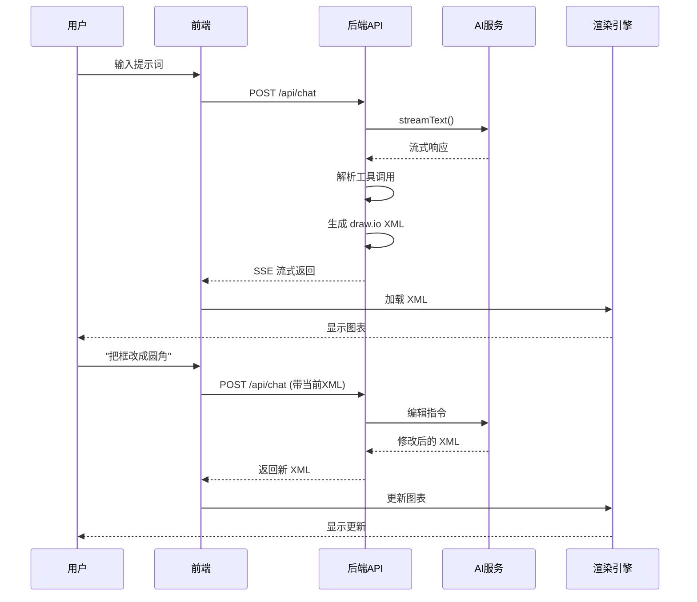

# DiagramAI - 技术架构与特性详解

## 🏗️ 整体架构

```
┌─────────────────────────────────────────────────────────┐
│                     前端界面层                            │
│  ┌─────────────┐  ┌──────────────┐  ┌──────────────┐   │
│  │  聊天界面    │  │  图表编辑器   │  │  设置面板     │   │
│  │ (Chat UI)   │  │  (Diagram)   │  │  (Settings)  │   │
│  └─────────────┘  └──────────────┘  └──────────────┘   │
└─────────────────────────────────────────────────────────┘
                          ↓
┌─────────────────────────────────────────────────────────┐
│                     状态管理层                            │
│  ┌──────────────┐  ┌──────────────┐  ┌──────────────┐  │
│  │ Context API  │  │  Custom Hooks│  │  LocalStorage│  │
│  │  会话状态     │  │   业务逻辑    │  │   持久化      │  │
│  └──────────────┘  └──────────────┘  └──────────────┘  │
└─────────────────────────────────────────────────────────┘
                          ↓
┌─────────────────────────────────────────────────────────┐
│                    AI 交互层                             │
│  ┌──────────────────────────────────────────────────┐  │
│  │  Vercel AI SDK (Streaming + Tool Calling)       │  │
│  │  • 流式输出处理                                     │  │
│  │  • 工具调用管理                                     │  │
│  │  • 多模型适配                                       │  │
│  └──────────────────────────────────────────────────┘  │
└─────────────────────────────────────────────────────────┘
                          ↓
┌─────────────────────────────────────────────────────────┐
│                   后端 API 层                            │
│  /api/chat          - 主要聊天接口                        │
│  /api/validate-*    - 图表验证接口                        │
│  /api/server-models - 服务端模型配置                      │
│  /api/parse-url     - URL 内容解析                       │
└─────────────────────────────────────────────────────────┘
                          ↓
┌─────────────────────────────────────────────────────────┐
│                  外部 AI 服务                             │
│  OpenAI / Anthropic / Google / DeepSeek / ...          │
└─────────────────────────────────────────────────────────┘
```

---

## 🎯 核心模块详解

### 1. **聊天引擎 (Chat Engine)**

**位置**: `components/chat-panel.tsx`, `app/api/chat/route.ts`

**核心功能**:
- ✅ 流式响应处理（边生成边显示）
- ✅ 工具调用编排（display_diagram, edit_diagram）
- ✅ 错误恢复和重试机制
- ✅ 历史消息管理和快照

**技术亮点**:
```typescript
// 使用 Vercel AI SDK 的 streamText
const result = streamText({
    model: aiModel,
    messages: convertedMessages,
    tools: {
        display_diagram: {
            // 生成新图表
        },
        edit_diagram: {
            // 编辑现有图表
        }
    },
    maxSteps: 3 // 支持多步推理
})
```

**流程**:
1. 用户输入 → 2. API 调用 → 3. AI 响应 → 4. 工具调用 → 5. 图表渲染

---

### 2. **图表渲染引擎 (Diagram Renderer)**

**位置**: `contexts/diagram-context.tsx`, `react-drawio`

**核心功能**:
- ✅ 实时渲染 draw.io XML
- ✅ 交互式编辑支持
- ✅ 缩放、拖拽、选择
- ✅ 导出多种格式（PNG/SVG/XML）

**技术亮点**:
```typescript
// 使用 react-drawio 库进行渲染
<DrawIoEmbed
    xml={chartXML}
    onSave={handleSave}
    configuration={{
        defaultEdgeStyle: 'rounded=1',
        defaultVertexStyle: 'rounded=1'
    }}
/>
```

**支持的图表类型**:
- 📊 流程图 (Flowchart)
- 🏗️ 架构图 (Architecture)
- 📐 UML 图 (Class/Sequence/Use Case)
- 🌊 泳道图 (Swimlane)
- 🧠 思维导图 (Mind Map)
- 📈 时序图 (Timeline)

---

### 3. **会话管理系统 (Session Manager)**

**位置**: `lib/session-storage.ts`, `hooks/use-session-manager.ts`

**核心功能**:
- ✅ IndexedDB 持久化存储
- ✅ 多会话并行管理
- ✅ 自动保存和恢复
- ✅ 历史快照和版本控制

**数据结构**:
```typescript
interface Session {
    id: string               // 会话 ID
    title: string           // 会话标题
    messages: UIMessage[]   // 聊天消息
    diagramXml: string      // 当前图表 XML
    xmlSnapshots: Map       // 历史版本快照
    updatedAt: number       // 更新时间
    thumbnailDataUrl?: string // 缩略图
}
```

**技术亮点**:
- 使用 IndexedDB 而非 LocalStorage（支持大文件）
- 自动生成缩略图用于会话列表
- 智能清理策略（保留最近 50 个会话）

---

### 4. **多模态输入处理 (Multimodal Input)**

**位置**: `lib/use-file-processor.tsx`, `lib/pdf-utils.ts`

**支持的输入类型**:

#### 📸 图片识别
```typescript
// 支持格式: PNG, JPG, WebP, GIF
// 功能: AI 识别图表内容并复制结构
handleFileChange(imageFile)
```

#### 📄 PDF 解析
```typescript
// 使用 unpdf 库提取文本和图片
const { text, images } = await extractPdfContent(pdfFile)
```

#### 🔗 URL 内容提取
```typescript
// 使用 @extractus/article-extractor
const article = await extract(url)
// 提取标题、正文、图片
```

**处理流程**:
1. 文件上传 → 2. 格式检测 → 3. 内容提取 → 4. 转换为文本 → 5. 发送给 AI

---

### 5. **AI 模型适配层 (AI Provider Abstraction)**

**位置**: `lib/ai-providers.ts`

**支持的提供商**:
- 🔵 OpenAI (GPT-4, GPT-3.5)
- 🟣 Anthropic (Claude 3)
- 🔴 Google (Gemini)
- 🟠 DeepSeek
- 🟢 AWS Bedrock
- ⚫ Ollama (本地部署)
- 🌐 OpenRouter (多模型网关)

**统一接口**:
```typescript
export function getAIModel(config: AIConfig) {
    switch (config.provider) {
        case 'openai':
            return createOpenAI({ apiKey })(config.model)
        case 'anthropic':
            return createAnthropic({ apiKey })(config.model)
        case 'deepseek':
            return createDeepSeek({ apiKey })(config.model)
        // ...
    }
}
```

**智能特性**:
- ✅ 自动选择最佳模型
- ✅ 支持自定义端点
- ✅ 提示词缓存（降低成本）
- ✅ 速率限制和配额管理

---

### 6. **智能验证系统 (Diagram Validation)**

**位置**: `lib/diagram-validator.ts`, `hooks/use-validate-diagram.ts`

**验证方式**:

#### 🔍 语法验证
```typescript
// 检查 XML 格式正确性
// 验证必需属性存在
// 检查 ID 唯一性
validateXmlSyntax(xml)
```

#### 🤖 AI 视觉验证
```typescript
// 使用 Vision 模型验证渲染效果
// 对比用户需求和实际图表
// 生成改进建议
validateWithVLM(xml, userPrompt, screenshot)
```

**验证流程**:
1. 生成图表 → 2. 截图 → 3. AI 分析 → 4. 返回建议 → 5. 自动改进

---

### 7. **配置管理 (Configuration)**

**位置**: `hooks/use-model-config.ts`, `components/settings-dialog.tsx`

**配置层级**:
```
环境变量 (.env.local)
    ↓
服务器配置 (ai-models.json)
    ↓
用户配置 (LocalStorage)
```

**可配置项**:
- 🔑 API Keys（多提供商）
- 🌐 自定义端点
- 🎨 UI 主题（暗色/亮色）
- 🌍 语言设置
- ⌨️ 快捷键设置
- ✅ 验证开关

---

### 8. **性能优化 (Performance)**

#### 🚀 代码分割
```typescript
// 懒加载大型组件
const DrawIoEmbed = lazy(() => import('react-drawio'))
```

#### 📦 流式传输
```typescript
// 使用 Server-Sent Events (SSE)
// 边生成边显示，降低首屏等待时间
for await (const delta of result.textStream) {
    yield delta
}
```

#### 💾 智能缓存
```typescript
// 提示词缓存（Anthropic）
// 减少重复计算，降低成本 50%
promptCaching: {
    enabled: true,
    cachePoints: ['system', 'tools']
}
```

#### ⚡ 并发控制
```typescript
// 限制并发请求数
// 防止 API 速率限制
const queue = new PQueue({ concurrency: 3 })
```

---

## 🔐 安全特性

### 1. **密钥安全**
- ✅ API Key 仅存储在客户端浏览器
- ✅ 服务器不记录任何密钥
- ✅ HTTPS 加密传输

### 2. **访问控制**
```typescript
// 支持访问码保护
if (ACCESS_CODE_LIST) {
    const code = req.headers.get('x-access-code')
    if (!ACCESS_CODE_LIST.includes(code)) {
        return 401 Unauthorized
    }
}
```

### 3. **SSRF 防护**
```typescript
// 防止服务端请求伪造攻击
validateUrlSafety(url)
```

### 4. **输入验证**
```typescript
// 文件类型白名单
// 文件大小限制
// 内容安全检查
```

---

## 📊 数据流示例

### 用户创建图表的完整流程:



---

## 🎨 UI/UX 设计理念

### 1. **极简交互**
- 对话式操作，无需学习复杂工具
- 所见即所得的编辑体验

### 2. **实时反馈**
- 流式输出，无等待感
- 进度指示器
- 错误提示友好

### 3. **响应式设计**
- 支持桌面、平板、手机
- 自适应布局

### 4. **无障碍支持**
- 键盘快捷键
- 屏幕阅读器支持
- 高对比度模式

---

## 🔧 开发者工具

### 调试模式
```typescript
// 开发环境自动启用
const DEBUG = process.env.NODE_ENV === 'development'
```

### 日志追踪
```typescript
// 使用 Langfuse 进行 AI 调用追踪
import { trace } from '@langfuse/client'
```

### 错误监控
```typescript
// 捕获并上报错误
try {
    await generateDiagram()
} catch (error) {
    console.error('Diagram generation failed:', error)
    toast.error('生成失败，请重试')
}
```

---

## 📈 未来计划

- [ ] 支持更多图表类型（甘特图、网络拓扑图）
- [ ] 协作编辑功能
- [ ] 模板库和社区分享
- [ ] 自动布局优化
- [ ] 导出 PPT/Word
- [ ] 插件系统

---

**DiagramAI - 让 AI 成为你的专业制图助手** 🚀
